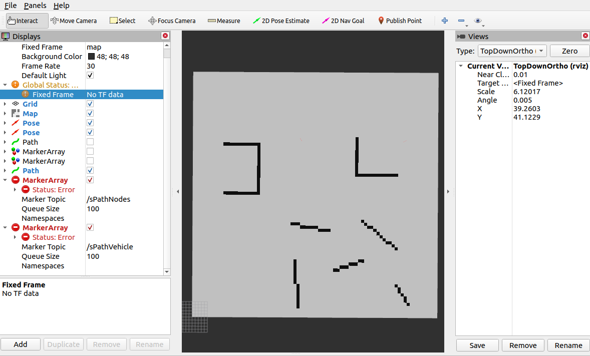

# Hybrid A star Algorithm Analysis

* [author's master thesis](https://kth.diva-portal.org/smash/get/diva2:1057261/FULLTEXT01.pdf)
* [code repo github](https://github.com/karlkurzer/path_planner)

## 1. Data Flow

in `main.cpp`

```c++
    // init ros node
    ros::init(argc, argv, "a_star");

    // main function
    HybridAStar::Planner hy;
    hy.plan();  // main process

    ros::spin();
    return 0;
```

there are two main parts,
* `HybridAStar::Planner`, use constructor function to initialize an instance of planner
* `HybridAStar::Planner::plan()`, include each sub-part of the main process

### 1.1 Constructor function

firstly, publish a topic named `/move_base_simple/start`, from [ROS WIKI](http://wiki.ros.org/move_base_simple).

message type is `geometry_msgs::PoseStamped`, including 3-D coordinates, [Points](http://docs.ros.org/en/noetic/api/geometry_msgs/html/msg/Point.html)
and pose orientation, [Quaternion](http://docs.ros.org/en/noetic/api/geometry_msgs/html/msg/Quaternion.html).
And will use a function to define value of this message.

then define several subscribers, including
* `/map`, call function `Planner::setMap`
* `/move_base_simple/goal`, call function `Planner::setGoal`
* `/initialpose`, call function `Planner::setStart`

publish a topic for start point, subscribe topics for start point, goal and map.

#### 1.1.1 set map

```c++
    grid = map;  // grid: nav_msgs::OccupancyGrid::Ptr
    //update the configuration space with the current map
    configurationSpace.updateGrid(map);
```

`grid` is an instance of `nav_msgs::OccupancyGrid::Ptr`, a pointer in navigation message package.

`configurationSpace` is an instance of class `CollisionDetection`; updating grid is rather simple.

```c++
  /*!
     \brief updates the grid with the world map
  */
  void updateGrid(nav_msgs::OccupancyGrid::Ptr map) {grid = map;}
```

but it seems no difference with line above, why?

```c++
    int height = map->info.height;
    int width = map->info.width;
    bool** binMap;
    binMap = new bool*[width];
```

`binMap`, a pointer to a bool pointer, `binMap = new bool*[width]`, 
using `new` to alloc memory for this, type is `bool*`, a bool type pointer,
with number of `width`.

这一步创建了一个指向指针的指针，并且使用`new`进行内存分配，分配了`width`个类型为`bool*`的变量。

```c++
    for (int x = 0; x < width; x++){
        binMap[x] = new bool[height];
    }
```

now `binMap` is a 2 dimension pointer array with range of `width` * `height`.

```c++
    for (int x = 0; x < width; ++x) {
        for (int y = 0; y < height; ++y) {
            binMap[x][y] = map->data[y * width + x] ? true : false;
        }
    }
```

using a `?:` operator, can be simplified as `xxx != 0`;
* if `map->data[y * width + x] = true`, `binMap[x][y] = true`
* if `map->data[y * width + x] = false`, `binMap[x][y] = false`

```c++
    voronoiDiagram.initializeMap(width, height, binMap);
    voronoiDiagram.update();
    voronoiDiagram.visualize();
```

some voronoi diagram stuff, ignore here. `binMap` is used in voronoi diagram.

#### 1.1.2 set goal

```c++
    // retrieving goal position
    float x = end->pose.position.x / Constants::cellSize;
    float y = end->pose.position.y / Constants::cellSize;
    float t = tf::getYaw(end->pose.orientation);

    std::cout << "I am seeing a new goal x:" << x << " y:" << y << " t:" << Helper::toDeg(t) << std::endl;

    if (grid->info.height >= y && y >= 0 && grid->info.width >= x && x >= 0) {
        validGoal = true;
        goal = *end;

        if (Constants::manual){
            plan();
        }
    } 
```

why call `plan()` here?

#### 1.1.3 set start

```c++
void Planner::setStart(const geometry_msgs::PoseWithCovarianceStamped::ConstPtr& initial) {
    float x = initial->pose.pose.position.x / Constants::cellSize;
    float y = initial->pose.pose.position.y / Constants::cellSize;
    float t = tf::getYaw(initial->pose.pose.orientation);
}
```

set coordinates of start.

```c++
    geometry_msgs::PoseStamped startN;
    startN.pose.position = initial->pose.pose.position;
    startN.pose.orientation = initial->pose.pose.orientation;
    startN.header.frame_id = "map";
    startN.header.stamp = ros::Time::now();

    if (grid->info.height >= y && y >= 0 && grid->info.width >= x && x >= 0) {
        validStart = true;
        start = *initial;
    
        if (Constants::manual) { plan();}
    
        // publish start for RViz
        pubStart.publish(startN);
    }
```

if start is valid, call `plan()` here, and publish start information to topic `"/move_base_simple/start"`.

but I'm confused why `plan()` need to be called here, even it will be called in the next step in `main`?

before the program running into `ros::spin()`, message of start and goal is sent by publisher, 

then the program goes into `plan()`

### 1.2 `Planner::plan()`

firstly, define list pointers and initialize lists

```c++
        int width = grid->info.width;
        int height = grid->info.height;
        int depth = Constants::headings;
        int length = width * height * depth;
        // define list pointers and initialize lists
        Node3D* nodes3D = new Node3D[length]();
        Node2D* nodes2D = new Node2D[width * height]();
```

then define the goal point

```c++
        x = start.pose.pose.position.x / Constants::cellSize;
        y = start.pose.pose.position.y / Constants::cellSize;
        t = tf::getYaw(start.pose.pose.orientation);
```

the planning will start

```c++
        // CLEAR THE VISUALIZATION
        visualization.clear();
        // CLEAR THE PATH
        path.clear();
        smoothedPath.clear();
        // FIND THE PATH
        Node3D* nSolution = Algorithm::hybridAStar(
                nStart, nGoal, nodes3D, nodes2D, width, height,
                configurationSpace, dubinsLookup, visualization);
        // TRACE THE PATH
        smoother.tracePath(nSolution);
        // CREATE THE UPDATED PATH
        path.updatePath(smoother.getPath());
        // SMOOTH THE PATH
        smoother.smoothPath(voronoiDiagram);
        // CREATE THE UPDATED PATH
        smoothedPath.updatePath(smoother.getPath());
```

* main part, get an initial path by `Algorithm::hybridAStar`
* send path to smoother, `smoother.tracePath(nSolution)`
* send path to `path`
* smooth path, `smoother.smoothPath(voronoiDiagram);`
* update smoothed path

and the rest will be ROS topic and service stuff.

```c++
        // PUBLISH THE RESULTS OF THE SEARCH
        path.publishPath();
        path.publishPathNodes();
        path.publishPathVehicles();
        smoothedPath.publishPath();
        smoothedPath.publishPathNodes();
        smoothedPath.publishPathVehicles();
        visualization.publishNode3DCosts(nodes3D, width, height, depth);
        visualization.publishNode2DCosts(nodes2D, width, height);

        // delete lists
        delete [] nodes3D;
        delete [] nodes2D;
```

but I'm still confused about the data transferring between ROS-rviz and this program.

**Providing a ROS graph here**,


Summarise some questions:

* what is the different between `initialpose` and `move_base_simple/start`?
* in which way the map image is delivered?
* what's the function of `tf` in this ROS program?

Map is sent to ROS master when running the `manual.launch` script, through the `map_server` node.
In detail, by loading a `yaml` file to choose map file, namely a jpg file.

According to the simulation process, user can add start and goal in rviz. 
Meanwhile, data will be transferred to this program, through ROS master and node, but which node?

### 1.3 Overall Analysis

我为什么又写了这么一节？因为耽搁了几天回来再看的时候，我忘了我写到哪了，就记得整体的数据流还没分析清楚。
上面的1.1， 1.2两个小节也提出了一些问题，在此做一个整汇总。

So in `main.cpp`, firstly create an instance of `Planner` class.
As we know about c++ feature, this will lead to the call of constructor function by this class.

According to analysis above, we know that in the constructor function, several publisher and subscriber are defined.
* publisher: "/move_base_simple/start"
* subscriber: "/map", callback function is `setMap`
* subscriber: "/move_base_simple/goal", callback function is `setGoal`
* subscriber: "/initialpose", callback function is `setStart`

As stated by ROS WIKI, only when the program reaches `ros::spin()` can the
subscribers start to receive message and callback their functions.
So process above only name some variables.

Then the program goes to `plan()`.
However, without valid start and goal point, this will not be proceeded.

Now it's time for `ros::spin()`, if user provide start and goal information to `RVIZ`,
the message will be received by those subscribers, and callback functions will be called.

In callback functions `setStart` and `setGoal`, `plan()` shall be called again and again
once when the start or goal is set or changed.

Until now, data flow is basically clear.


## 2. Main Functions

### 2.1 Map data structure and usage

* in `manual.launch`, node `map_server` is launched and use the `map.yaml` to config.
* node will publish topic called `/map` automatically, as said in [ROS wiki](http://wiki.ros.org/map_server), type of this topic is [nav_msgs/OccupancyGrid](http://docs.ros.org/en/api/nav_msgs/html/msg/OccupancyGrid.html)
* then in the planning part, a subscriber named `subMap` will receive map data from topic.
* after that, work belongs to planner

```c++
	// initiate the broadcaster
    ros::init(argc, argv, "tf_broadcaster");
    ros::NodeHandle n;

    // subscribe to map updates
    ros::Subscriber sub_map = n.subscribe("/occ_map", 1, setMap);
```

and

```c++
void setMap(const nav_msgs::OccupancyGrid::Ptr map) {
    std::cout << "Creating transform for map..." << std::endl;
    grid = map;
}
```

when program goes to `ros::Spinonce()`, subscriber will receive message and call the callback function.

then `grid` is a pointer that pointing to the `map`.

> 对于有些传输特别快的消息，尤其需要注意合理控制消息池大小和ros::spinOnce()执行频率; 比如消息送达频率为10Hz, ros::spinOnce()的调用频率为5Hz，那么消息池的大小就一定要大于2，才能保证数据不丢失，无延迟。

### 2.2 ROS interface

in the launch file, manual, 

```xml
<launch>
 <!-- Turn on hybrid_astar node -->
 <node name="hybrid_astar" pkg="hybrid_astar" type="hybrid_astar" /> 
 <node name="tf_broadcaster" pkg="hybrid_astar" type="tf_broadcaster" />
 <node name="map_server" pkg="map_server" type="map_server" args="$(find hybrid_astar)/maps/map.yaml" />
 <node name="rviz" pkg="rviz" type="rviz" args="-d $(find hybrid_astar)/launch/config.rviz" />
</launch>
```

there are four main nodes, including pose, map, `rviz` and planner node.

hybrid a star node will be analyzed later on. Now we shall focus on the ROS part, which is the other three.

#### 2.2.1 tf broadcaster

`/tf_broadcaster` publish `/tf` topic and received by `/hybrid_astar`.

```c++
int main(int argc, char** argv) {
    // initiate the broadcaster
    ros::init(argc, argv, "tf_broadcaster");
    ros::NodeHandle n;

    // subscribe to map updates
    ros::Subscriber sub_map = n.subscribe("/occ_map", 1, setMap);
    tf::Pose tfPose;


    ros::Rate r(100);
    tf::TransformBroadcaster broadcaster;

    while (ros::ok()) {
        // transform from geometry msg to TF
        if (grid != nullptr) {
            tf::poseMsgToTF(grid->info.origin, tfPose);
        }

        // odom to map
        broadcaster.sendTransform(tf::StampedTransform(
                tf::Transform(tf::Quaternion(0, 0, 0, 1),
                              tfPose.getOrigin()),ros::Time::now(),
                              "odom", "map"));

        // map to path
        broadcaster.sendTransform(tf::StampedTransform(
                tf::Transform(tf::Quaternion(0, 0, 0, 1),
                              tf::Vector3(0, 0, 0)),ros::Time::now(),
                              "map", "path"));

        ros::spinOnce();
        r.sleep();
    }
}
```

* `tf::Transform` refer to a relative movement and rotation，指的是两个相对点之间的平动与旋转转换关系
* `tf::StampedTransform`，from one frame to another frame. 指的是两个系之间的转换
* `broadcaster.sendTransform`, send this transform

注释掉这两个`broadcaster.sendTransform`后，调试`hybrid a star`这个node，不会报missing start or end point这个错（作者写的）；

start和end在rivz中设置完后，debug信息为：

```
### Hybrid A* Search
A pathfinding algorithm on grids, by Karl Kurzer
### cell size: 1
### mode: manual
I am building the collision lookup table... done!
missing goal or start
created Voronoi Diagram in ms: 1.157173000
I am seeing a new start x:10.3428 y:13.7992 t:37.875
missing goal or start
I am seeing a new goal x:65.6446 y:65.0988 t:271.364
TIME in ms: 46.885373000
```

可以看到两个start和end point已经设置好了，信息传到了hybrid里，planner已经完成。但是在rviz中不会显示path和vehicle的路径，没传过来。

```c++
        // _________________________________
        // PUBLISH THE RESULTS OF THE SEARCH
        path.publishPath();
        path.publishPathNodes();
        path.publishPathVehicles();
        smoothedPath.publishPath();
        smoothedPath.publishPathNodes();
        smoothedPath.publishPathVehicles();
        visualization.publishNode3DCosts(nodes3D, width, height, depth);
        visualization.publishNode2DCosts(nodes2D, width, height);
```

问题就出在这些publisher里。



No TF data and two MarkerArray are empty.


a weird rqt graph...

通过断点调试debug，发现确实存在smoothed path，数据基本正常，但在图中没有显示。

如果在rqt graph中取消对dead sinks的隐藏，可以看到多出了若干topic，如：

* /path 开头
* /visualize 开头

可以再次证明，smooth已经完成，并且`path`和`smoothPath`两个类成员的变量中包括了对应的信息，唯一的问题就是，该marker array信息，没有传给rviz，或是没有publish成功。

好像是因为，这些话题的函数中，都有规定，let's take `publishNode3DPose` as an example,

```c++
void Visualize::publishNode3DPose(Node3D& node) {
    geometry_msgs::PoseStamped pose;
    pose.header.frame_id = "path";
    pose.header.stamp = ros::Time::now();
    pose.header.seq = 0;
    pose.pose.position.x = node.getX() * Constants::cellSize;
    pose.pose.position.y = node.getY() * Constants::cellSize;

    //FORWARD
    if (node.getPrim() < 3) {
        pose.pose.orientation = tf::createQuaternionMsgFromYaw(node.getT());
    }
    //REVERSE
    else {
        pose.pose.orientation = tf::createQuaternionMsgFromYaw(node.getT() + M_PI);
    }

    // PUBLISH THE POSE
    pubNode3D.publish(pose);
}
```

notice that the `pose.header.frame_id="path"`, while there is no such frame defaultly.

and the origin of odom frame is in the center of it, transfer it to the map frame, then to the path frame, so that the visualization works.

then I changed a little thing in the `tf_broadcaster.cpp`, delete other Transforms

```c++
        // tset my thought
        broadcaster.sendTransform(tf::StampedTransform(
                        tf::Transform(tf::Quaternion(0, 0, 0, 1),
                                      tfPose.getOrigin()), ros::Time::now(),
                                      "map", "path"
                        )
                );
```

it seems work well.

Because `tfPose.getOrigin()` return with a **zero**.

#### 2.2.2 map server

Actually there isn't a map server in `cmakelist.txt`, but in the launch file, so the best way is to learn ros wiki.

ignore here.

#### 2.2.3 rviz


### 2.3 Dynamic voronoi diagram construction

this part will not be analyzed temporarily.

### 2.4 Hybrid A star algorithm

This part is in class `algorithm.cpp` and `algorithm.h`.

Got 4 functions(one class member) and a struct.
* float `aStar`
* void `updateH`
* Node3D* `dubinsShot`
* Node3D* `Algorithm::hybridAStar`
* struct `CompareNodes`.

#### 2.4.1 Node for 3D and 2D

The Node class by author is defined to describe each node of hybrid A star node, 
just like A star node with information of `x,y,g,f`.

The difference between 2D and 3D is whether to take $\theta$ into consideration.

In `Node2D.h and cpp`, there are several functions:

* `isOnGrid`, if this node is inside the map
* `createSuccessor(const int i)`, set the next node according to i, which has 8 options.
* `bool Node2D::operator == (const Node2D& rhs) const`, return if the same position
* `setIdx`, set id in a one dimension array

In `Node3D.h` and `Node3D.cpp`, there are more functions:

* `isOnGrid`, x and y is inside the map, and heading angle is less than 72 degree(defined by the author)
* `isInRange`, if is in the range of test Dubins shot
* `createSuccessor`

```c++
// R = 6, 6.75 DEG
const float Node3D::dy[] = { 0,        -0.0415893,  0.0415893};
const float Node3D::dx[] = { 0.7068582,   0.705224,   0.705224};
const float Node3D::dt[] = { 0,         0.1178097,   -0.1178097};
```


```c++
bool Node3D::isInRange(const Node3D& goal) const {
    int random = rand() % 10 + 1;
    // rand(), Return a random integer between 0 and RAND_MAX inclusive
    // #define	RAND_MAX	2147483647
    float dx = std::abs(x - goal.x) / random;
    float dy = std::abs(y - goal.y) / random;
    return (dx * dx) + (dy * dy) < Constants::dubinsShotDistance;
}
```

random?

```c++
Node3D* Node3D::createSuccessor(const int i) {
    float xSucc;
    float ySucc;
    float tSucc;

    // calculate successor positions forward
    if (i < 3) {
        xSucc = x + dx[i] * cos(t) - dy[i] * sin(t);
        ySucc = y + dx[i] * sin(t) + dy[i] * cos(t);
        tSucc = Helper::normalizeHeadingRad(t + dt[i]);
    }
    // backwards
    else {
        xSucc = x - dx[i - 3] * cos(t) - dy[i - 3] * sin(t);
        ySucc = y - dx[i - 3] * sin(t) + dy[i - 3] * cos(t);
        tSucc = Helper::normalizeHeadingRad(t - dt[i - 3]);
    }

    return new Node3D(xSucc, ySucc, tSucc, g, 0, this, i);
}
```


```c++
static inline float normalizeHeadingRad(float t) {
  if (t < 0) {
    t = t - 2.f * M_PI * (int)(t / (2.f * M_PI));
    return 2.f * M_PI + t;
  }

  return t - 2.f * M_PI * (int)(t / (2.f * M_PI));
}
```

just a normalize function if $t<0$;

```c++
void Node3D::updateG() {
    // forward driving
    if (prim < 3) {
        // if i < 3
        // penalize turning
        // if the direction changed from last motion
        if (pred->prim != prim) {
            // penalize change of direction, from backward to forward
            if (pred->prim > 2) {
                // penaltyTurning = 10.5, penaltyCOD = 2.0
                g += dx[0] * Constants::penaltyTurning * Constants::penaltyCOD;
            } else {
                // if still forward, just a minor direction changing
                // penaltyTurning = 10.5
                g += dx[0] * Constants::penaltyTurning;
            }
        } else {
            g += dx[0];
        }
    }
    // reverse driving
    else {
        // penalize turning and reversing
        if (pred->prim != prim) {
            // penalize change of direction
            if (pred->prim < 3) {
                g += dx[0] * Constants::penaltyTurning * Constants::penaltyReversing * Constants::penaltyCOD;
            } else {
                g += dx[0] * Constants::penaltyTurning * Constants::penaltyReversing;
            }
        } else {
            g += dx[0] * Constants::penaltyReversing;
        }
    }

}
```

for `updateG` function, take forward motion as an example,

* if the motion of last step is the same as this one, $g=g+dx[0]$
* else, will add other penalty
  * if the two motion is both forward, add a slight penalty
  * else, add a heavier penalty

I doubt about whether this method can satisfy dynamic constraint.

#### 2.4.2 Dubins

`dubinsShot` seems to be the one out of some complex data structure, so let's analyse it secondly.

```c++
Node3D* dubinsShot(Node3D& start, const Node3D& goal, CollisionDetection& configurationSpace) {
    // start
    double q0[] = { start.getX(), start.getY(), start.getT() };
    // goal
    double q1[] = { goal.getX(), goal.getY(), goal.getT() };
    // initialize the path
    DubinsPath path;
    // calculate the path
    dubins_init(q0, q1, Constants::r, &path);

    int i = 0;
    float x = 0.f;
    float length = dubins_path_length(&path);

    Node3D* dubinsNodes = new Node3D [(int)(length / Constants::dubinsStepSize) + 1];

    // avoid duplicate waypoint
    x += Constants::dubinsStepSize;
    while (x <  length) {
        double q[3];
        dubins_path_sample(&path, x, q);
        dubinsNodes[i].setX(q[0]);
        dubinsNodes[i].setY(q[1]);
        dubinsNodes[i].setT(Helper::normalizeHeadingRad(q[2]));

        // collision check
        if (configurationSpace.isTraversable(&dubinsNodes[i])) {
            // set the predecessor to the previous step
            if (i > 0) {
                dubinsNodes[i].setPred(&dubinsNodes[i - 1]);
            } else {
                dubinsNodes[i].setPred(&start);
            }

            if (&dubinsNodes[i] == dubinsNodes[i].getPred()) {
                std::cout << "looping shot";
            }

            x += Constants::dubinsStepSize;
            i++;
        } else {
            //      std::cout << "Dubins shot collided, discarding the path" << "\n";
            // delete all nodes
            delete [] dubinsNodes;
            return nullptr;
        }
    }

    //  std::cout << "Dubins shot connected, returning the path" << "\n";
    return &dubinsNodes[i - 1];
}
```

in the `dubins.cpp`, there is a detailed method.

#### 2.4.3 Conventional A star

Let's look back at conventional a star,


and they are basically the same. though the name of variables of this code is a little uncomfortable to an OCD patient like me.

#### 2.4.4 Update H

we know that $f=g+h$, and $g$ is related to the node's predecessor.

$h$ is associated with the position from node to goal, for conventional A star this can be $\sqrt{x^2+y^2}$. However, if $\theta$ is being considered, this $f$ could be more complicated, so the author has a function in `algorithm.cpp` to illustrate it.

one is to use Reed and Sheep curves to get cost, 

```c++
    if (Constants::reverse && !Constants::dubins) {
        ompl::base::ReedsSheppStateSpace reedsSheppPath(Constants::r);
        State* rsStart = (State*)reedsSheppPath.allocState();  // ompl::base::SE2StateSpace::StateType State
        State* rsEnd = (State*)reedsSheppPath.allocState();
        rsStart->setXY(start.getX(), start.getY());
        rsStart->setYaw(start.getT());
        rsEnd->setXY(goal.getX(), goal.getY());
        rsEnd->setYaw(goal.getT());
        reedsSheppCost = reedsSheppPath.distance(rsStart, rsEnd);
    }
```

remind that the start and goal denote two points in space, not the exactly start and goal position.

the second is 2-D heuristic,

```c++
    // if twoD heuristic is activated determine the shortest path
    // unconstrained with obstacles
    if (Constants::twoD && !nodes2D[(int)start.getY() * width + (int)start.getX()].isDiscovered()) {
        //    ros::Time t0 = ros::Time::now();
        // create a 2d start node
        Node2D start2d(start.getX(), start.getY(), 0, 0, nullptr);
        // create a 2d goal node
        Node2D goal2d(goal.getX(), goal.getY(), 0, 0, nullptr);
        // run 2d astar and return the cost of the cheapest path for that node
        nodes2D[(int)start.getY() * width + (int)start.getX()].setG(aStar(goal2d,
                                                                          start2d, nodes2D,
                                                                          width, height,
                                                                          configurationSpace,
                                                                          visualization));
    }

    if (Constants::twoD) {
        // offset for same node in cell
        twoDoffset = sqrt(((start.getX() - (long)start.getX()) - (goal.getX() - (long)goal.getX())) * ((start.getX() -
                          (long)start.getX()) - (goal.getX() - (long)goal.getX())) +
                          ((start.getY() - (long)start.getY()) - (goal.getY() -
                          (long)goal.getY())) * ((start.getY() - (long)start.getY()) - (goal.getY() - (long)goal.getY())));
        twoDCost = nodes2D[(int)start.getY() * width + (int)start.getX()].getG() - twoDoffset;
        // FIXME: why getG() here, isn't the function update H?
    }

    start.setH(std::max(reedsSheppCost, std::max(dubinsCost, twoDCost)));
```

since `dubins` is default  false, the last lambda is:

```c++
start.setG(std::max(reedsSheppCost, twoDCost));
```

这个地方必须是取G，因为在作者的传统A*函数中，最终的cost值是记录在G中的，所以只能用`getG`去拿到数据。然后和Reed曲线对比，取最大值。

**why the biggest?**

writer said in the comment, for admissible.

assume that A star with a smaller cost, while Reed and Sheep is the shortest path in theory when the obstacles are not taken into consideration.

So there only left with one solution, conventional A star is heavily not dynamic allowable. In this situation, a greater cost is admissible for forward planning.

Remind that `updateH` in `Node2D` gets the Euclid distance. 

#### 2.4.5 Hybrid A star process

```
if goal, stop and return this successor node
if within dubins search and collision free, use the dubins path
else, proceed normal search
	if successor is valid and isn't obstacle,
		if successor is not in close list and has the same index as the predecessor,
			update G and set new G
			if successor not on open list or found a shorter way to the cell
				get H, update H using updateH in algorithm.cpp
				if the successor is in the same cell but the f value is larger
					delete and continue
				else if successor is in the same cell and the C value is lower
					set predecessor to predecessor of predecessor
```

### 2.5 Non-linear optimization and Non-parametric interpolation

In this part, we'll focus on `smoother.cpp` and its header.

after the hybrid a star process, now come to optimization.

in `main.cpp`

```c++
        // TRACE THE PATH
        smoother.tracePath(nSolution);
        // CREATE THE UPDATED PATH
        path.updatePath(smoother.getPath());
        // SMOOTH THE PATH
        smoother.smoothPath(voronoiDiagram);
        // CREATE THE UPDATED PATH
        smoothedPath.updatePath(smoother.getPath());
```

and in the `planner.h`

```c++
    /// The path produced by the hybrid A* algorithm
    Path path;
    /// The smoother used for optimizing the path
    Smoother smoother;
    /// The path smoothed and ready for the controller
    Path smoothedPath = Path(true);
    /// The visualization used for search visualization
```

there are several class variables.

#### 2.5.1 trace path

definition of this function:

* input: path
* output: smoothed path in vector

```c++
    /*!
        \brief Given a node pointer the path to the root node will be traced recursively
        \param node a 3D node, usually the goal node
        \param i a parameter for counting the number of nodes
    */
    void tracePath(const Node3D* node, int i = 0, std::vector<Node3D> path = std::vector<Node3D>());
```

3 parameters, including one default parameter path.

```c++
void Smoother::tracePath(const Node3D* node, int i, std::vector<Node3D> path) {
    if (node == nullptr) {
        this->path = path;
        return;
    }

    i++;
    path.push_back(*node);
    tracePath(node->getPred(), i, path);
}
```

In planner,

```c++
smoother.tracePath(nSolution);
```

`nSolution` is a variable of  `Node3D*` type.

干嘛非得自己调用自己，直接取length然后for循环不行吗？

#### 2.5.2 update path

analyze the function `updatePath`.

in `smoother.h`,

```c++
const std::vector<Node3D>& getPath() {return path;}
```

this path is what we get at the code block

```c++
    if (node == nullptr) {
        this->path = path;
        return;
    }
```

then `this->path`, or the `path` member of the class is sent to function `updatePath`

```c++
path.updatePath(smoother.getPath());
```

in this function,

```c++
    int k = 0;
    for (size_t i = 0; i < nodePath.size(); ++i) {
        addSegment(nodePath[i]);
        addNode(nodePath[i], k);
        k++;
        addVehicle(nodePath[i], k);
        k++;
    }
```

this part is for visualization, ignore for now.

#### 2.5.3 smooth path

```c++
smoother.smoothPath(voronoiDiagram);
```

in the loop of all points on path,

firstly

```c++
            Vector2D xim2(newPath[i - 2].getX(), newPath[i - 2].getY());
            Vector2D xim1(newPath[i - 1].getX(), newPath[i - 1].getY());
            Vector2D xi(newPath[i].getX(), newPath[i].getY());
            Vector2D xip1(newPath[i + 1].getX(), newPath[i + 1].getY());
            Vector2D xip2(newPath[i + 2].getX(), newPath[i + 2].getY());
            Vector2D correction;
```

it's from $x_{i-2}$ to $x_{i+2}$.

then,

```c++
       	// the following points shall not be smoothed
        // keep these points fixed if they are a cusp point or adjacent to one
        if (isCusp(newPath, i)) { continue; }
```

let's see this function `isCusp`

```c++
inline bool isCusp(const std::vector<Node3D>& path, int i) {
    bool revim2 = path[i - 2].getPrim() > 3 ;
    bool revim1 = path[i - 1].getPrim() > 3 ;
    bool revi   = path[i].getPrim() > 3 ;
    bool revip1 = path[i + 1].getPrim() > 3 ;
    //  bool revip2 = path[i + 2].getPrim() > 3 ;

    return (revim2 != revim1 || revim1 != revi || revi != revip1);
}
```

although this sign should be `>=3` for a cusp point, which is a reverse motion.

this is referring a forward to reverse or backward change, which is called a cusp point.

the other smoothing operation including 4 parts, just as the original paper said.

And the author didn't finish voronoi part.

### 2.6 Appendix 1 OPML lib


## 3. Tricks